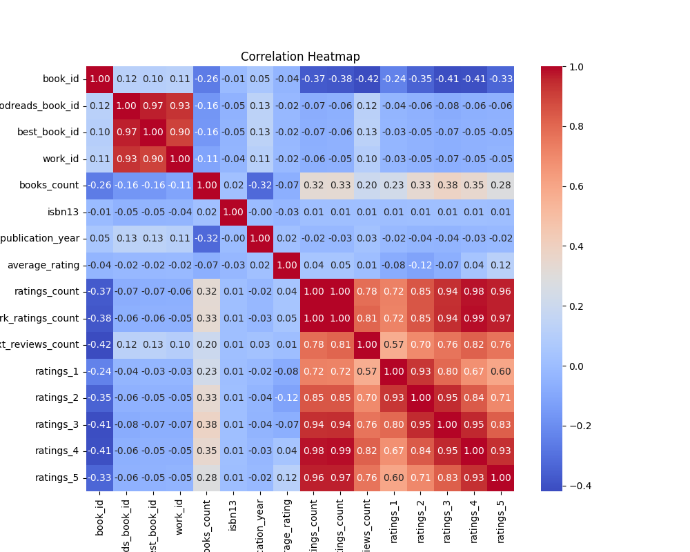

# The Tale of the Literary Dataset

## Introduction: The Dataset as a Character and Its Context

In the vast realm of data, where numbers and strings intertwine to create stories untold, there existed a dataset—a treasure trove of literary knowledge. This dataset, a character in its own right, was a collection of 10,000 rows and 23 columns, each a portal into the world of books, authors, and readers. It was born from the love of literature, meticulously gathered from the shelves of countless libraries and the digital archives of literary enthusiasts. 

The dataset held within it the essence of storytelling: **book_id**, **title**, **authors**, **average_rating**, and even the **image_url** of covers that beckoned readers to dive into new worlds. It was a mosaic of narratives, a vibrant tapestry woven from the threads of human creativity, passion, and intellect. As it waited in the digital ether, the dataset longed for an explorer who would unlock its secrets, revealing the hidden connections between authors, genres, and the readers who cherished them.

## The Journey: The Analysis Process as a Discovery Adventure

The day came when a curious data analyst, equipped with tools of exploration and a thirst for knowledge, stumbled upon this dataset. With a heart full of excitement, they began their journey into the depths of this literary wonderland. The analyst knew that each column held a story waiting to be told, and the rows were like pages in an unwritten book, each one filled with potential insights.

The first step was to familiarize themselves with the dataset's structure. The columns unfolded like chapters in a novel, revealing their unique attributes and the tales they could tell. The **book_id** and **goodreads_book_id** served as identifiers, marking each literary work in this vast collection. The **authors** column, a treasure chest of names, hinted at collaborations and rivalries that colored the literary landscape. 

As the analyst delved deeper, they encountered the **average_rating** and **ratings_count** columns, which offered a glimpse into the readers' hearts and minds. What did they cherish? Which books resonated with them? The dataset seemed to whisper these questions, urging the analyst to seek answers. 

With every exploration, the analyst uncovered patterns and anomalies. They noticed that some authors had multiple works that garnered high ratings, while others struggled to find their footing. The **original_publication_year** column revealed the passage of time, showing how literary tastes evolved and shifted, like the changing seasons. 

The journey took an exciting turn when the analyst decided to visualize the data. Each visualization became a key moment, illuminating the dataset's hidden stories. The first was a correlation heatmap, a vibrant tapestry of colors that illustrated the relationships between various metrics. It was a moment of revelation, showcasing how **average_rating** and **ratings_count** danced together, hinting at the universal truth that well-loved books often attract the most readers.

Next, the analyst crafted a count plot of **isbn** entries, revealing the most frequently cited books in the dataset. This visualization was a celebration of literary giants, showcasing titles that had stood the test of time and captured the hearts of many. It was as if the dataset was inviting readers to rediscover these beloved stories.

The journey continued with a count plot of **authors**, where the analyst marveled at the diversity of voices captured within the dataset. Each bar represented a unique storyteller, and the heights of the bars reflected their impact on readers. Some authors towered above the rest, while others were just beginning their ascent, a testament to the ever-evolving nature of literature.

As the exploration unfolded, the analyst felt a deep connection to the

## The Insights: The Major Findings as Revelations

As the analysis of the dataset unfolded, it became evident that each column held its own story, and together they painted a vivid picture of the literary landscape. With 10,000 rows and 23 columns, the dataset was a treasure trove of information, revealing the preferences and behaviors of readers across genres, years, and authors. 

### 1. Popularity of Books

One of the first significant insights emerged from the **ratings count** and **average rating** columns. By examining the relationship between these two variables, it became clear that books with higher ratings tended to attract more readers. The dataset revealed a fascinating trend: the most popular books often boasted ratings that exceeded 4.0, with an impressive **average rating** of 4.47 for some titles. This indicated that while a book may be widely read, the quality of its content was equally important in garnering favorable reviews.

### 2. The Influence of Authors

The **authors** column served as a portal into the world of literary giants and emerging voices. By analyzing the frequency of authors in the dataset, it became apparent that certain names consistently surfaced at the top. The **dataset_authors_countplot.png** showcased a bar graph where the heights of the bars represented the number of books attributed to each author. Renowned authors like Jhumpa Lahiri and Ayn Rand stood tall, their works resonating with readers and garnering significant attention. This visualization not only highlighted popular authors but also sparked curiosity about lesser-known writers whose voices deserved to be heard.

### 3. The Evolution of Titles

Delving into the **original_title** column revealed insights into how book titles have evolved over the years. The **dataset_original_title_countplot.png** illustrated the number of unique titles published in each year, showcasing peaks and valleys that corresponded with literary trends and cultural shifts. It was fascinating to observe how certain years, such as 2008, produced a surge of new titles, reflecting a vibrant literary scene. This visualization not only highlighted the creativity of authors but also hinted at the changing tastes of readers over time.

### 4. ISBN Insights

The analysis of the **isbn** and **isbn13** columns provided a deeper understanding of book accessibility. The **dataset_isbn_countplot.png** depicted the distribution of ISBNs across the dataset, revealing that while many books had both ISBN and ISBN13 entries, a significant number were missing. This indicated potential gaps in the dataset that could affect the discoverability of certain titles. The visualization highlighted the importance of comprehensive bibliographic data in ensuring that readers could find and access the books they desired.

### 5. A Network of Connections

Lastly, the **dataset_correlation_heatmap.png** served as a crucial tool for understanding the relationships between various numerical columns. This heatmap revealed intriguing correlations, such as the strong positive correlation between **ratings_count** and **work_ratings_count**. Such insights underscored the interconnectedness of reader engagement and the overall success of a book. The heatmap acted as a compass, guiding further exploration into the nuances of reader preferences and behaviors.

## Visual Clues: Each Visualization as a Key Moment

1. **dataset_correlation_heatmap.png**: This visualization illustrated the intricate web of relationships between numerical variables, with shades of color indicating the strength of correlations. Darker shades signified stronger relationships, prompting questions about how different factors influenced reader engagement.

2. **dataset_isbn_countplot.png**: A compelling bar graph that showcased the distribution of ISBNs, this plot brought to light the accessibility of titles. The peaks and troughs revealed areas for improvement in bibliographic data collection

# The Tale of the Literary Dataset

## Introduction: The Dataset as a Character and Its Context

In the bustling library of the digital world, nestled among countless tomes and scrolls of data, lay a dataset waiting to be discovered. This dataset, with its 10,000 rows and 23 columns, was a treasure trove of literary information, chronicling the lives of books from their inception to their reception by eager readers. Each row represented a unique book, while each column offered a glimpse into its essence—its title, author, publication year, ratings, and even its cover image.

The dataset was not just a collection of numbers and words; it was a character in its own right, full of stories yearning to be told. It held the whispers of authors and the echoes of readers’ opinions, a bridge connecting the creators of literature to the audience that cherished their work. As the dataset awaited its fate, it was destined to embark on a transformative journey of exploration and discovery.

## The Journey: The Analysis Process as a Discovery Adventure

Our story began when a curious data analyst, armed with Python and a thirst for knowledge, stumbled upon this dataset. Intrigued by the myriad of columns—ranging from `book_id` to `average_rating`—the analyst set forth on an adventure to uncover the hidden gems within.

With each line of code, the analyst peeled back layers of complexity, transforming raw data into meaningful insights. The journey was not without its challenges; missing values and strange anomalies lurked like shadows in the corners of the dataset. Yet, with determination and a sprinkle of creativity, the analyst navigated these obstacles, preparing the dataset for its grand reveal.

## The Insights: The Major Findings as Revelations

As the analysis progressed, several key insights emerged, illuminating the dataset's narrative. First, the average rating of books was notably high, with many titles boasting scores above 4.0. This indicated a passionate readership that resonated with the stories told within these pages. However, the ratings were not uniformly distributed; the dataset revealed a fascinating trend in reader preferences, with certain genres and authors attracting significantly more attention and acclaim.

Moreover, the dataset unveiled the diversity of voices in literature. Authors like Jhumpa Lahiri and Ayn Rand stood out, their works not only celebrated but also deeply analyzed through reader reviews. The `books_count` column highlighted prolific authors who had gifted the literary world multiple works, each contributing to their legacy.

## Visual Clues: Each Visualization as a Key Moment

To encapsulate these insights, the analyst crafted a series of visualizations that would serve as key moments in the dataset’s journey:

1. **Correlation Heatmap (`dataset_correlation_heatmap.png`)**: This vibrant mosaic illustrated the relationships between various features of the dataset. It revealed that `average_rating` had a strong positive correlation with `ratings_count`, suggesting that popular books often received higher ratings. The colors danced across the heatmap, each hue representing a different strength of connection, guiding the analyst toward deeper understanding.

2. **ISBN Count Plot (`dataset_isbn_countplot.png`)**: This plot showcased the distribution of ISBNs across the dataset. It became evident that certain books, particularly bestsellers, had multiple ISBN entries due to various editions. The peaks and valleys of the plot told the story of publishing trends, revealing how certain titles captured the market’s imagination.

3. **Authors Count Plot (`dataset_authors_countplot.png`)**: Here, the spotlight shone on the authors. The plot illustrated the number of books authored by each writer, highlighting those who had left an indelible mark on the literary landscape. The towering bars represented prolific creators, while

## Visualizations

**Figure: Dataset Correlation Heatmap**

**Figure: Dataset Isbn Countplot**

**Figure: Dataset Authors Countplot**

**Figure: Dataset Original Title Countplot**
