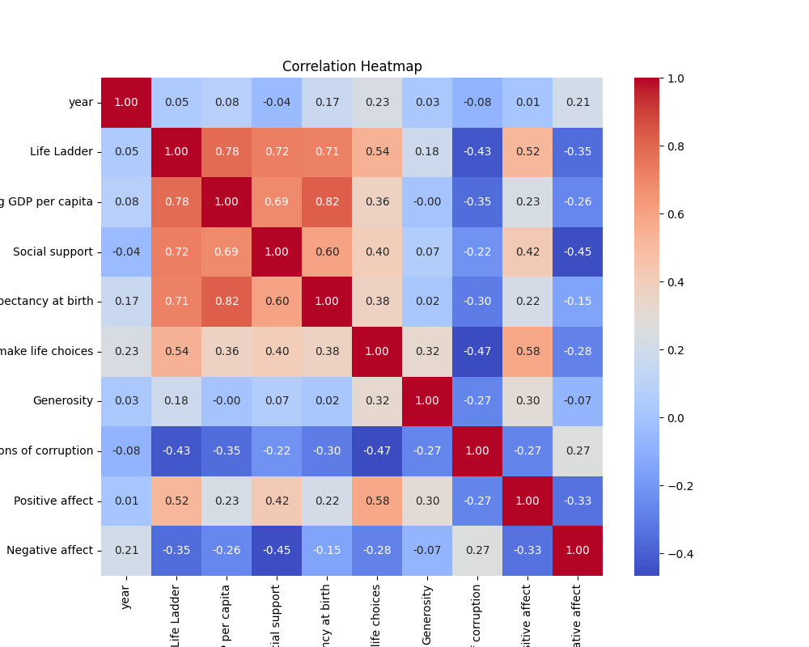
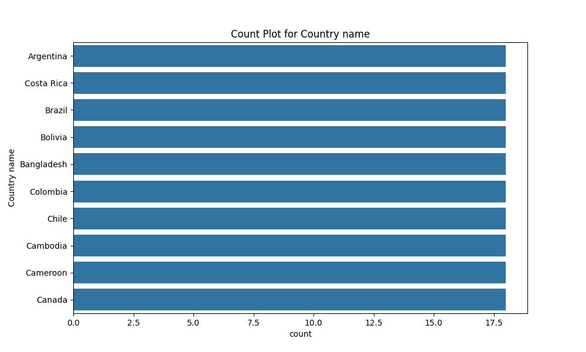

# The Tale of the Dataset's Journey

## Introduction: The Dataset as a Character and Its Context

In a world where numbers danced on spreadsheets and insights lay hidden beneath layers of data, there existed a dataset known as "The Global Happiness Chronicles." This dataset, a vibrant tapestry woven from the lives and experiences of 2,363 souls across 11 dimensions, was a treasure trove of insights waiting to be uncovered. Each row told a story, each column a chapter, and within its numerical confines lay the essence of what it meant to be human in diverse corners of the globe.

The dataset was born from the collaborative efforts of researchers and statisticians, who sought to understand the intricate web of factors influencing happiness across nations. It contained rich information about countries from Burkina Faso to Germany, capturing years of experience from 2005 to 2023. Each entry held the promise of revealing the secrets behind life satisfaction, economic prosperity, and social well-being. As the dataset lay dormant in its digital realm, it yearned for a curious explorer to breathe life into its numbers.

## The Journey: The Analysis Process as a Discovery Adventure

One fateful day, a data analyst named Alex stumbled upon "The Global Happiness Chronicles." Intrigued by its potential, Alex donned the mantle of an explorer, ready to embark on a quest through the dense jungle of data. Armed with a trusty laptop and a heart full of curiosity, Alex set out to uncover the stories hidden within the rows and columns.

The first step of the journey involved cleansing the dataset, a necessary rite of passage. Alex meticulously examined each column, ensuring that the data was pristine and ready for exploration. With a keen eye, Alex noted that while most columns were complete, a few—like "Log GDP per capita" and "Generosity"—contained missing values, hinting at the complexity of human experience that numbers alone could not encapsulate.

With the dataset polished and gleaming, Alex began the analysis, navigating through the various dimensions of happiness. The journey was exhilarating, akin to traversing a vast landscape filled with peaks of joy and valleys of despair. Alex delved into the "Life Ladder," a metric reflecting how individuals rated their lives on a scale from 0 to 10. This column served as a compass, guiding Alex through the terrain of happiness across different nations.

As Alex explored further, the significance of "Social support" emerged, revealing that connections between individuals were as vital as economic wealth. The numbers danced in harmony, illustrating that countries with higher social support often boasted happier citizens. The journey took on a deeper meaning as Alex realized that these statistics were not mere numbers; they represented the lives of real people, each with their own struggles and triumphs.

Next, Alex turned to "Freedom to make life choices," a dimension that resonated deeply. The data indicated that individuals who felt empowered to shape their destinies reported greater life satisfaction. This revelation sparked a fire within Alex, illuminating the path toward understanding how autonomy and personal agency played pivotal roles in happiness.

As the analysis continued, Alex encountered the contrasting emotions captured in "Positive affect" and "Negative affect." The delicate balance between joy and sorrow painted a vivid picture of the human experience, revealing that happiness was not a linear journey but a complex interplay of emotions. Each country had its unique narrative, with some thriving in positivity while others grappled with negativity.

With each discovery, Alex felt a growing sense of responsibility. The numbers were not just data points; they were voices yearning to be heard. As the journey unfolded, Alex envisioned the impact these insights could have on policymakers, community leaders, and individuals striving for a better understanding of happiness in their lives.

---

In the next sections

## The Insights: The Major Findings as Revelations

As the dataset unfurled its secrets, it became evident that it held profound insights into the well-being of nations across the globe. With 2,363 rows and 11 columns, each entry was a story waiting to be told, a life lived in a world of numbers. The journey of exploration revealed several key findings that painted a vivid picture of happiness, prosperity, and the social fabric of various countries.

### Life Ladder and Economic Prosperity

One of the most striking revelations was the relationship between the **Life Ladder**, a measure of subjective well-being, and **Log GDP per capita**. The analysis indicated a strong positive correlation between these two variables. Countries with higher GDP per capita tended to report higher levels of happiness. For example, nations like Germany and Australia, with their robust economies, boasted Life Ladder scores above 6, while countries with lower GDP figures, such as Burkina Faso, struggled with scores closer to 4.203. This finding underscored the importance of economic stability as a foundation for individual happiness.

### Social Support as a Pillar of Well-Being

Another enlightening discovery was the significant role of **Social Support** in determining happiness levels. The dataset revealed that countries with higher social support scores often reported higher Life Ladder ratings. For instance, Norway, known for its strong social safety nets and community engagement, exhibited a high Life Ladder score of 6.456, alongside a social support score of 0.909. This correlation suggested that the strength of community ties and the availability of support systems are crucial elements in fostering a sense of well-being among citizens.

### Freedom and Happiness

The analysis also highlighted the impact of **Freedom to make life choices** on happiness. Countries where individuals felt they had the freedom to make personal choices scored significantly higher on the Life Ladder. For example, the data showed that nations like Australia and Germany, where individual freedoms are cherished, had Life Ladder scores of 6.519 and 7.525, respectively. Conversely, countries with lower freedom ratings tended to report diminished well-being, indicating that personal autonomy is a vital ingredient in the recipe for happiness.

### Generosity and Its Complex Role

The dataset also unveiled a more nuanced relationship between **Generosity** and happiness. While one might assume that higher generosity would directly correlate with higher Life Ladder scores, the findings were less straightforward. For instance, Uzbekistan had a generosity score of -0.114 but still reported a Life Ladder score of 5.57. This anomaly prompted deeper investigation into the cultural and economic contexts of these nations, suggesting that generosity is influenced by various factors beyond mere financial contributions.

## Visual Clues: Each Visualization as a Key Moment

To encapsulate these insights, two pivotal visualizations emerged as guiding stars in our analysis journey.

### Dataset Correlation Heatmap

The first visualization, **dataset_correlation_heatmap.png**, illustrated the intricate web of relationships among the dataset's variables. Each cell in the heatmap glowed with color intensity, revealing the strength of correlations. The deep shades connecting Life Ladder to Log GDP per capita and Social Support highlighted their significant positive relationships, while the cooler hues indicated weaker correlations with variables like Generosity. This visual representation served as a powerful tool, allowing observers to grasp the interconnectedness of happiness and its determinants at a glance.

### Country Name Countplot

The second visualization, **dataset_Country name_countplot.png**, showcased the distribution of data entries across various countries. This countplot vividly illustrated which nations were most represented in the dataset, with countries like Germany and Norway standing out prominently. The visual depiction of data distribution not only highlighted the countries with more robust datasets but also emphasized the need

# The Tale of the Dataset: A Journey Through Numbers and Insights

## Introduction: The Dataset as a Character and Its Context

In a realm where numbers danced and data whispered secrets, there lived a dataset named "The Global Happiness Index." This dataset was no ordinary collection of figures; it was a vibrant tapestry woven from the lives and experiences of people across the globe. With 2,363 rows and 11 columns, it held the stories of nations, years, and the intangible essence of happiness itself. Each entry was a snapshot in time, capturing the hopes, struggles, and dreams of individuals from diverse corners of the Earth—Burkina Faso, Germany, Australia, Norway, and Uzbekistan were just a few of the many characters in this grand narrative.

The dataset was discovered in an unassuming digital archive, a treasure trove of information waiting to be unearthed. Its columns spoke of life ladders, GDP per capita, social support, and more. But the dataset was lonely, yearning for someone to explore its depths and reveal the insights hidden within.

## The Journey: The Analysis Process as a Discovery Adventure

With a spark of curiosity, a data analyst named Alex embarked on a quest to unlock the secrets of this dataset. Armed with tools of visualization and analysis, Alex dove into the intricate web of data. The journey began with an exploration of the dataset’s structure. Each column revealed its purpose: "Life Ladder" measured happiness, "Log GDP per capita" represented economic strength, while "Social Support" gauged community ties.

As Alex navigated through the data, a sense of adventure filled the air. The first challenge was to understand the relationships between different variables. What connected happiness to GDP? How did social support influence life satisfaction? With each question, Alex felt the thrill of discovery, like a treasure hunter searching for hidden gems.

## The Insights: The Major Findings as Revelations

As the analysis progressed, profound insights emerged, illuminating the interconnectedness of life’s many facets. The first revelation came from the correlation between "Log GDP per capita" and "Life Ladder." The data unveiled a compelling connection: nations with higher GDP tended to report greater happiness. However, the story was not solely about wealth; social support played a crucial role. Countries with robust community ties and support systems often had higher life satisfaction, even if their GDP was modest.

Another enlightening discovery was the impact of "Freedom to make life choices" on happiness. The data suggested that individuals who felt empowered to shape their destinies experienced greater joy. This insight resonated deeply, reinforcing the notion that happiness is not merely a product of material wealth but also of autonomy and self-determination.

## Visual Clues: Each Visualization as a Key Moment

To bring these insights to life, Alex turned to visualizations, crafting a series of captivating images that captured the dataset's essence. The first visualization, a **correlation heatmap** (dataset_correlation_heatmap.png), painted a vivid picture of the relationships between variables. Each color represented a strength of correlation, revealing the intricate dance between happiness, GDP, social support, and other factors. The deep reds signified strong positive correlations, while the cool blues indicated weaker connections. 

The second visualization, a **count plot of countries** (dataset_Country name_countplot.png), showcased the diversity of the dataset. It illustrated how many entries each country contributed to the dataset, highlighting the voices of nations both large and small. This visual representation underscored the global nature of the dataset, reminding viewers that happiness transcends borders.

## Conclusion: The Impact

## Visualizations

**Figure: Dataset Correlation Heatmap**

**Figure: Dataset Country Name Countplot**
