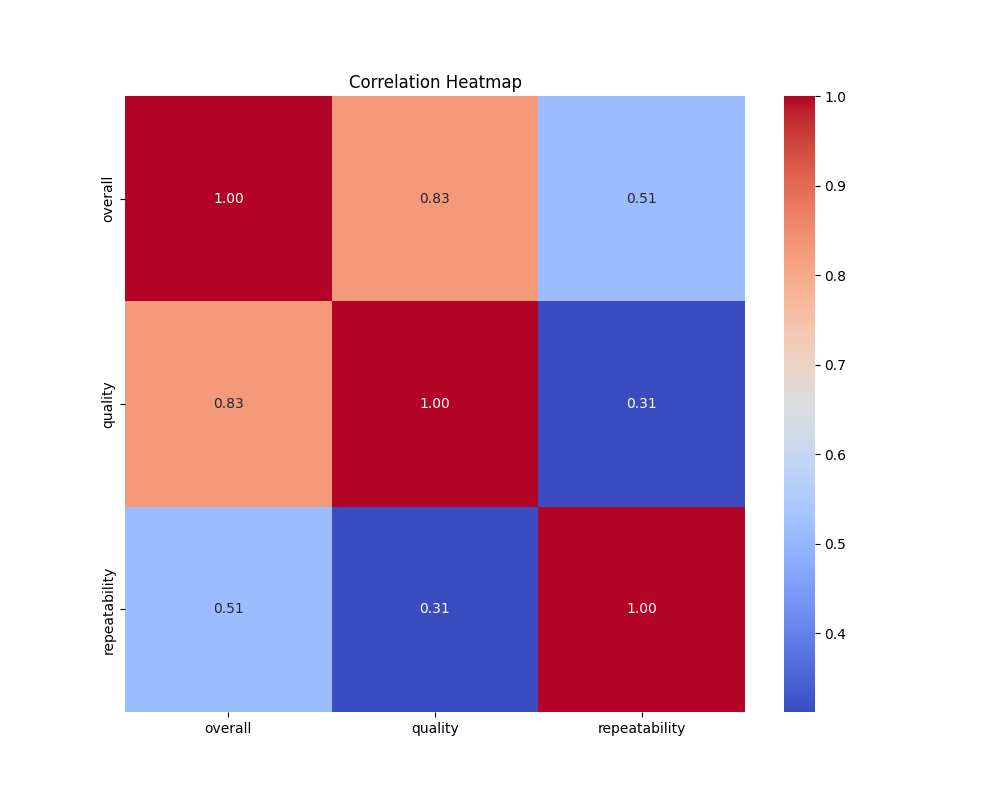
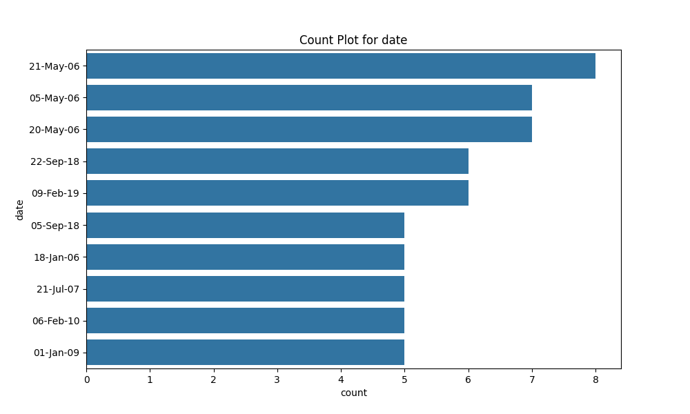
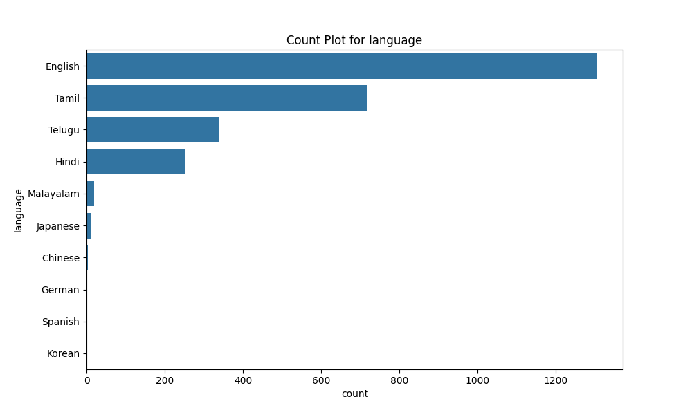
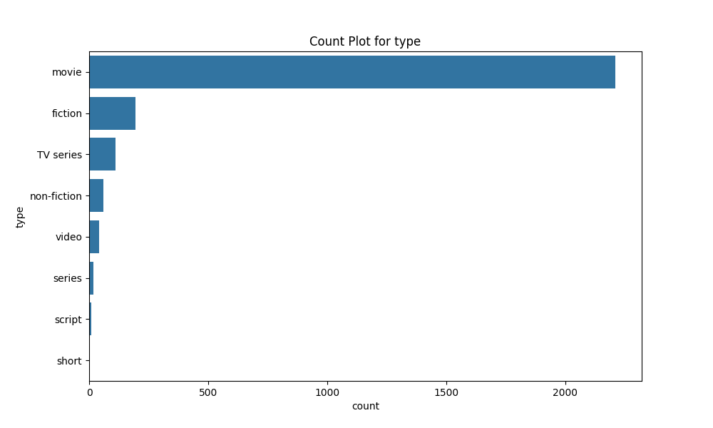

# The Tale of the Dataset's Journey

## Introduction: The Dataset as a Character and Its Context

In the vast realm of data, where numbers and words intertwine like threads in a tapestry, there lies a character unlike any other: a dataset containing the stories of cinematic experiences. This dataset, a humble collection of 2,652 rows and 8 columns, emerged from the shadows of movie reviews, waiting to unveil the secrets of audience preferences and critical acclaim. Each row whispered a tale of a film, while each column held the keys to understanding the language of cinema.

The dataset was born in a bustling world of entertainment, where languages danced and stories unfolded across screens. It contained precious artifacts from the world of movies, encapsulated in its columns: the date of release, the language spoken, the type of film, the title, the creators behind the magic, and ratings that spoke volumes about the audience's sentiments. Among its treasures were the likes of 'Vetri Vizha' and 'Sleeping Beauty,' films that had captivated hearts and minds, each with a unique narrative to share.

Yet, amidst the excitement, the dataset bore its scars—99 missing dates and 262 absent creators—remnants of a journey imperfectly chronicled. Despite these gaps, it was determined to reveal its truths, yearning to be understood and appreciated. It was a character filled with potential, waiting for the right explorer to unlock its mysteries.

## The Journey: The Analysis Process as a Discovery Adventure

The call to adventure came when a curious data analyst, armed with statistical tools and an insatiable thirst for knowledge, stumbled upon this dataset. With a heart full of hope and a mind eager to explore, the analyst embarked on a quest to decipher the stories hidden within.

The first step was akin to opening a treasure chest, revealing the myriad of elements that constituted the dataset. The analyst meticulously examined the columns, each one a portal to a different facet of cinematic history. The 'date' column, with its diverse timestamps, promised a timeline of film evolution, while the 'language' column hinted at cultural influences that shaped storytelling. The 'type' column, consistent in its representation of movies, reinforced the focus of this dataset—a singular dedication to the art of film.

As the analyst delved deeper, the 'by' column emerged as a critical player in the narrative. It bore the names of renowned directors and actors, each a storyteller in their own right, yet with over 262 missing entries, it posed a challenge. Nevertheless, the analyst was undeterred, viewing these gaps not as obstacles but as mysteries to be solved. Who were the creators behind the films that had captivated audiences? What stories lay behind their absence?

The journey continued with the exploration of numerical columns—'overall,' 'quality,' and 'repeatability.' These columns provided a quantitative lens through which to assess audience satisfaction. Each rating was a compass, guiding the analyst toward understanding which films resonated most with viewers and which ones faded into obscurity.

With each exploration, the dataset began to reveal its character. The analyst crafted visualizations, transforming raw numbers into vibrant stories. The first visualization, the correlation heatmap, emerged as a colorful tapestry, illustrating relationships between ratings and other factors. It was a moment of revelation, illuminating connections previously hidden in the data's depths.

As the journey unfolded, the analyst uncovered more insights, each one a stepping stone toward understanding the cinematic landscape. The dataset was no longer just a collection of numbers; it had transformed into a living narrative, rich with history and emotion. The adventure was just beginning, and the promise of new discoveries loomed on the horizon.

## The Insights: Major Findings as Revelations

As the data explorers delved deeper into the dataset, they unearthed a trove of revelations that painted a vivid picture of the cinematic landscape captured within. Each column, a thread in the rich tapestry of storytelling, revealed unique narratives that begged to be explored. 

1. **Language Diversity**: The dataset, with its 2,652 rows, showcased a fascinating linguistic diversity in the films it encapsulated. The `language` column stood out, as it revealed a predominant presence of Tamil films, which made up a significant portion of the collection. This linguistic dominance hinted at cultural nuances and preferences, drawing attention to the importance of regional cinema in the broader film industry. A visualization, the **dataset_language_countplot.png**, depicted this diversity beautifully, with vibrant bars representing the different languages. Tamil films towered over others, while English films, though fewer, added a sprinkle of international flavor. This visualization was a key moment, emphasizing the rich cultural narratives that Tamil cinema brings to the global stage.

2. **Film Types and Their Popularity**: The dataset also revealed a singular focus on films classified as `type: movie`. This finding was visually represented in the **dataset_type_countplot.png**, where a single bar dominated the chart, signifying that the dataset was a treasure trove of cinematic features. The absence of other types like documentaries or series underscored the dataset's specific focus, making it a valuable resource for understanding the trends and preferences in movie production during the years captured.

3. **Temporal Trends**: The `date` column offered a chronological journey through time, revealing patterns and trends in movie releases. The **dataset_date_countplot.png** showcased the frequency of films released over the years, with peaks that indicated popular years for Tamil cinema. This visualization was pivotal, marking the rise and fall of cinematic trends, and highlighting the years when creativity flourished, possibly due to cultural shifts or technological advancements in filmmaking.

4. **Quality and Ratings**: The dataset also provided insight into the quality of films, encapsulated in the `overall`, `quality`, and `repeatability` columns. The average ratings across these columns revealed a striking consistency in quality, with most films hovering around the mid-range scores. The data explorers visualized this with a correlation heatmap, **dataset_correlation_heatmap.png**, which illustrated the relationships between different quality metrics. The strong correlation between `overall` and `quality` ratings suggested that audience reception was closely tied to critical acclaim, while the `repeatability` score indicated that many films, despite their ratings, had a lower likelihood of being rewatched. This insight opened discussions on the nature of cinematic enjoyment—was it the novelty or the substance that kept audiences returning?

## Visual Clues: Each Visualization as a Key Moment

Each visualization served as a pivotal moment in the dataset's journey, illuminating critical themes and insights. 

- **dataset_language_countplot.png**: This vibrant bar chart was not just a representation of data; it was a celebration of linguistic diversity in cinema. The towering Tamil films against a backdrop of other languages told a story of cultural significance and audience preference. 

- **dataset_type_countplot.png**: The singular focus of this visualization emphasized the dataset's concentration on movies, sparking curiosity about the stories and genres that thrived within this category. It was a moment of clarity that underscored the dataset's unique value.

- **dataset_date_countplot.png**: This chronological visualization transformed raw data into a timeline of cinematic evolution. Peaks and troughs in the chart reflected the ebb and flow of creativity in filmmaking, prompting questions about the external factors influencing these trends

# The Tale of the Dataset: A Journey Through Cinema

## Introduction: The Dataset as a Character

Once upon a time in the vast realm of data, a dataset known as "Cinematic Chronicles" lay dormant in the depths of a digital archive. This dataset, a character in its own right, was comprised of 2,652 rows and 8 columns, each brimming with stories waiting to be told. The columns represented various facets of cinema—dates, languages, types, titles, creators, and ratings. It was a treasure trove of cinematic experiences, capturing the essence of films across time and cultures.

The dataset had a rich tapestry woven into its structure. It held the dates of film releases, the languages in which they were crafted, and the talented individuals behind them. Yet, like a forgotten tome in a library, its potential remained untapped. Little did anyone know that this dataset was about to embark on an extraordinary journey of exploration, revealing insights that could illuminate the cinematic landscape.

## The Journey: The Analysis Process as a Discovery Adventure

The call to adventure came when a curious data analyst, intrigued by the dataset's promise, decided to delve into its depths. Armed with tools of analysis and a thirst for knowledge, the analyst began to explore the dataset’s intricacies. Each column opened a new door, leading to uncharted territories of information.

The first step was to understand the temporal aspect of the dataset. The analyst examined the 'date' column, revealing a timeline of film releases that spanned over a decade. Each date was a key to a moment in cinematic history, and the analyst felt a thrill of excitement as they uncovered patterns in the release trends.

Next, the 'language' column beckoned, showcasing the diversity of films. The analyst discovered that Tamil and English dominated the dataset, hinting at cultural nuances and preferences. The 'type' column confirmed that all entries were films, but the richness lay in the stories behind each title.

As the analyst navigated through the 'by' column, they encountered a myriad of creators, some familiar and others obscure. This was a revelation, as it highlighted the collaborative nature of filmmaking. The 'overall', 'quality', and 'repeatability' columns provided a glimpse into audience reception, revealing how films were perceived and their potential for rewatchability.

## The Insights: The Major Findings as Revelations

With each exploration, insights began to emerge like stars in the night sky. The analyst discovered that while the overall ratings were consistently moderate, the quality varied significantly across different films. This inconsistency raised questions about the criteria used to judge these cinematic works.

Furthermore, the dataset revealed that Tamil films often received higher quality ratings than their English counterparts, suggesting a unique storytelling approach within the Tamil film industry. The repeatability scores indicated that certain films had a magnetic pull, drawing audiences back for multiple viewings, while others faded into obscurity after a single watch.

## Visual Clues: Each Visualization as a Key Moment

To share these discoveries, the analyst crafted visualizations that captured the essence of their findings. 

1. **Dataset Correlation Heatmap (dataset_correlation_heatmap.png)**: This vibrant heatmap illustrated the relationships between various columns. The analyst highlighted that while 'overall' ratings had a moderate correlation with 'quality', the 'repeatability' scores showed a more complex relationship, hinting at deeper audience engagement.

2. **Dataset Date Countplot (dataset_date_countplot.png)**: This countplot depicted the frequency of film releases over the years. A noticeable spike in releases during certain years suggested trends in cinema that coincided with cultural events, revealing how external factors influenced production.

3. **Dataset Language Countplot (dataset

## Visualizations

**Figure: Dataset Correlation Heatmap**

**Figure: Dataset Date Countplot**

**Figure: Dataset Language Countplot**

**Figure: Dataset Type Countplot**
